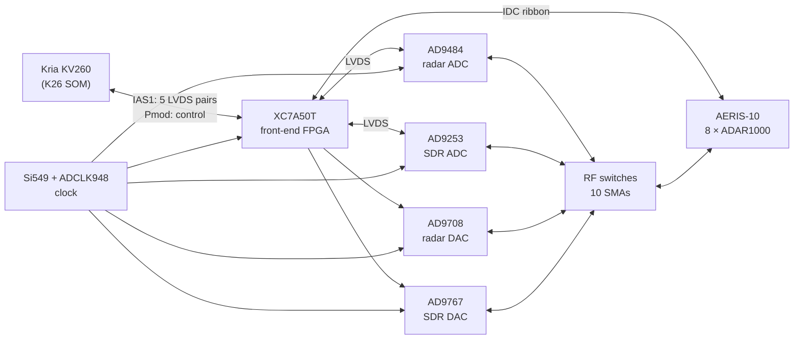
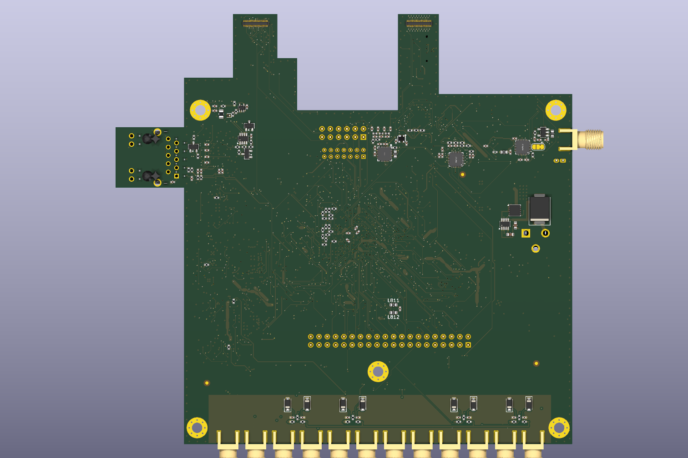
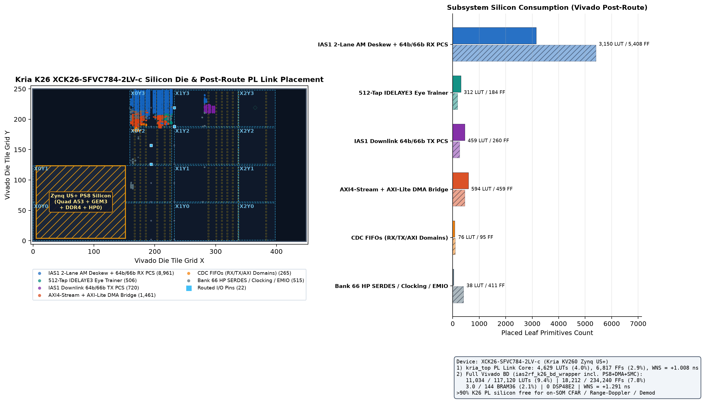
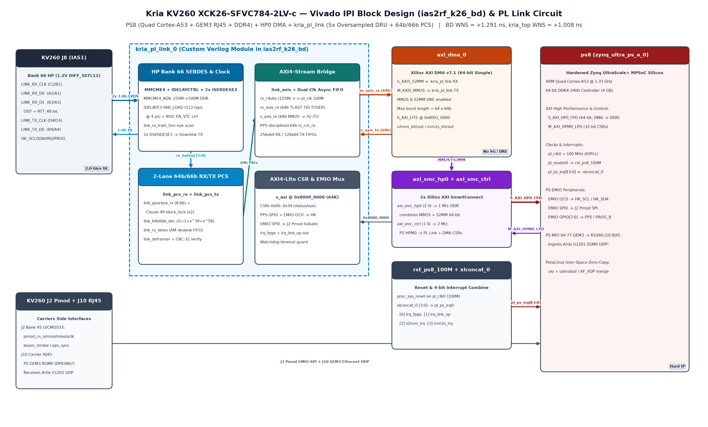
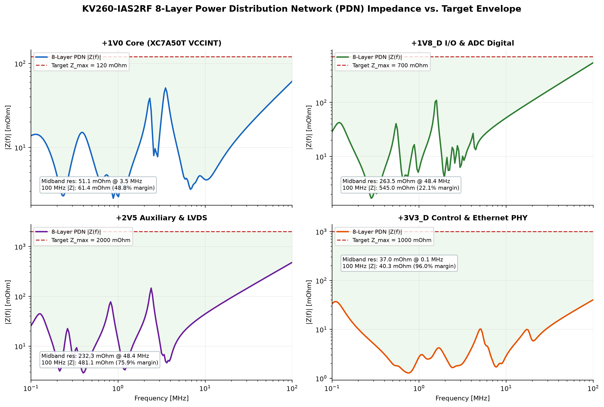
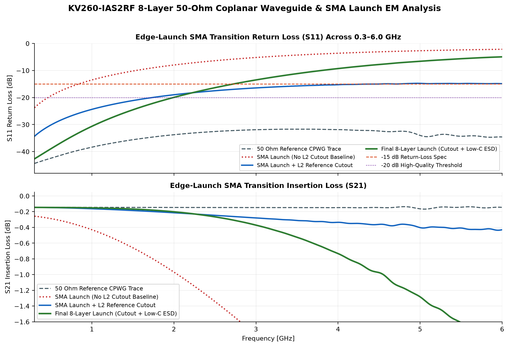
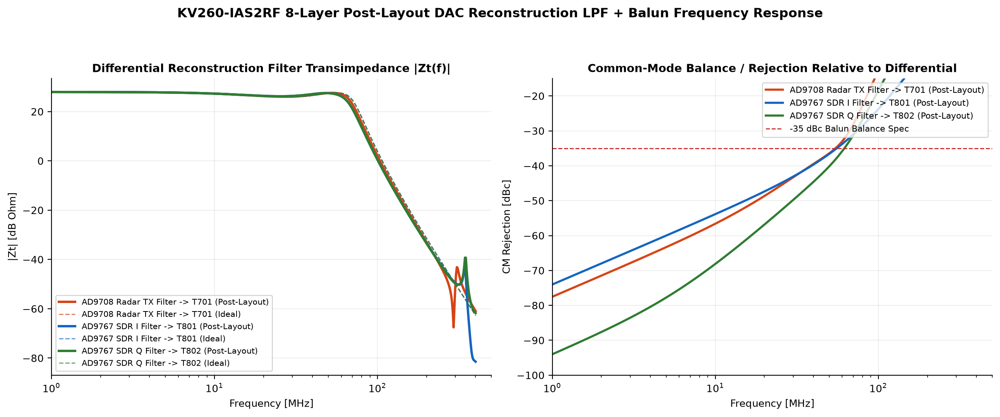
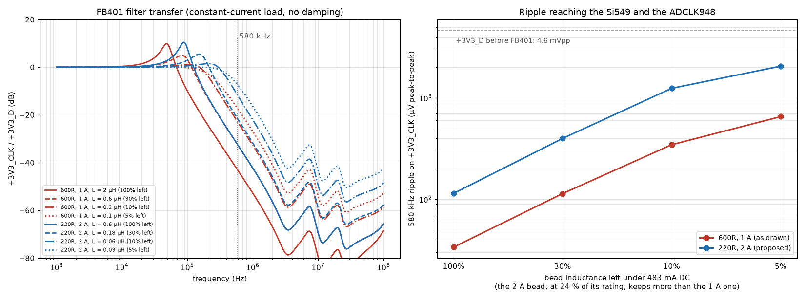
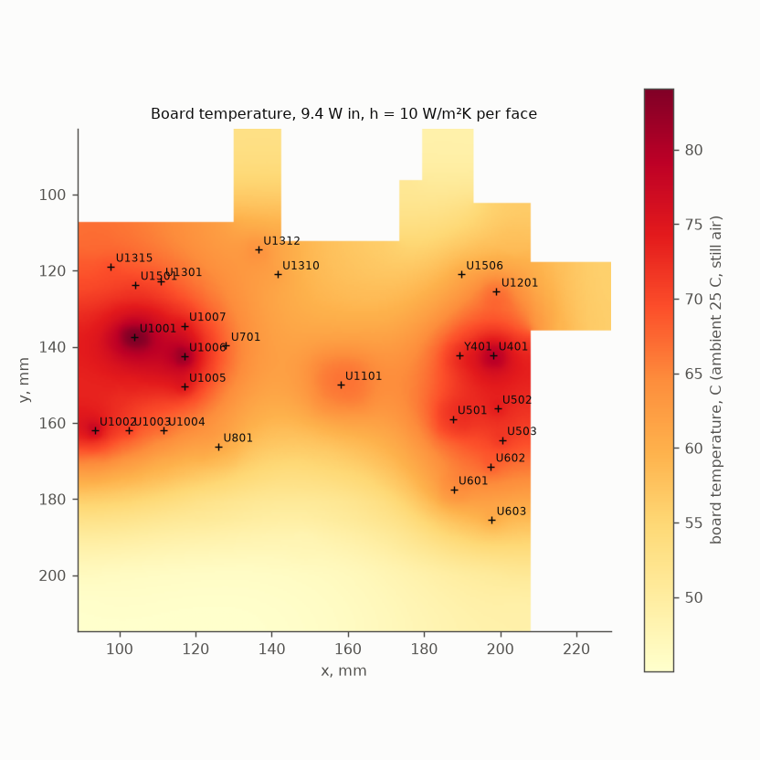
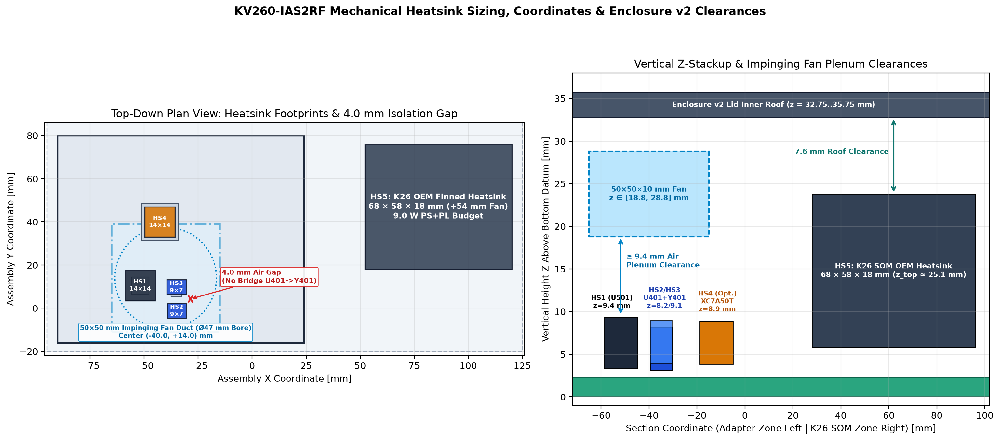

# KV260-IAS2RF: an RF front-end carrier for the AMD Kria KV260

**Status (15 November 2026): schematic and layout complete, on 8 layers. The board is fully routed, with zero
DRC errors and zero schematic-parity problems. It has not been fabricated, and no hardware has
been validated.** The hardware, dual-FPGA Vivado gateware, Enclosure v2 cooling, and full-system co-simulation are complete ([Status](#status)).

> **Current `main` Hardware & Gateware Baseline:** **8-layer `JLC08161H-2116C`** RF front-end adapter PCB with dedicated-pin **1000BASE-T Ethernet (`U1201 RTL8211FSI`) + dual-lane `IAS1` (`~2.94 Gb/s` aggregate)**, failover in the dual-FPGA Vivado 2026.1 gateware ([docs/FPGA_GATEWARE.md](docs/FPGA_GATEWARE.md)), `5 V` header `J1002` for filtered Enclosure v2 active cooling ([ENCLOSURE.md](docs/ENCLOSURE.md)), and `0` KiCad DRC / parity errors. Historical design evolution from initial drafts is archived in [docs/history/README.md](docs/history/README.md) and tagged `rev01`–`rev06`.


An adapter board for the **AMD Kria KV260 Vision AI Starter Kit**. It plugs into the KV260's IAS1
camera connector and carries the converters, a common clock and a front-end FPGA. It serves two
signal chains:

- **Software-defined radio**: HF to 30 MHz directly; FM, airband, VHF/UHF amateur bands and PMR446 through
  an external converter until the Rev08 receive front end ([plan](docs/REV08_PLAN.md)). Receive, and
  transmit on the bands a licence covers.
- **Radar at 10.5 GHz**: the IF of the X-band chain from the open
  [AERIS-10 / PLFM_RADAR](https://github.com/NawfalMotii79/PLFM_RADAR) project, with ADAR1000
  beamforming. The 10.5 GHz chain itself is reused from AERIS-10, not redesigned here. The board
  is sized for 8 ADAR1000s (32 channels), so it covers both the Nexus variant (4 chips) and the
  Extended one (8 chips).

> ### The finding that shapes the whole project
>
> The **IAS0 (J7) connector on the KV260 does not reach the programmable logic**: its MIPI lanes
> run into an AP1302 ISP soldered on the carrier card. Only **IAS1 (J8)** is wired straight to
> the SOM. On top of that, **the KV260 has no 40-pin Raspberry Pi header** (J9 is a 15-pin
> camera connector), and **the GTH transceivers are not exposed**.
>
> The real I/O budget between a KV260 and an external board is **8 differential pairs and about
> 14 single-ended signals**. That is why the board has its own FPGA. The evidence and sources are
> in [docs/BLOCKERS_AND_RISKS.md](docs/BLOCKERS_AND_RISKS.md).

---

## The board at a glance

| | |
|---|---|
| Size | 119 × 132 mm, 140 × 132 with the RJ45's tab. It mounts on the KV260's IAS connectors and corner holes and overhangs to one side ([INTERFACE_SPEC §5.3](docs/INTERFACE_SPEC.md)) |
| Stackup | 8 layers, JLCPCB `JLC08161H-2116C`: `L1 SIG – L2 GND – L3 SIG – L4 PWR (split) – L5 GND – L6 SIG – L7 GND – L8 SIG` ([LAYOUT §3](docs/LAYOUT.md)) |
| Parts | 561 fitted, none DNP: 485 on the top face and 76 on the bottom (the Hirose connectors, the LVDS terminations and VCCINT caps under the FPGA, the switches' bias parts, the input protection) |
| Front-end FPGA | Xilinx XC7A50T-2FTG256I (the same part as AERIS-10) with a 128 Mb QSPI flash, plus JTAG |
| Radar ADC | AD9484, 8 bit, 400 MSPS, driven by two cascaded AD8352s |
| SDR ADC | AD9253, 14 bit, two channels at 62.5 MSPS (one LVDS lane each) |
| Radar DAC | AD9708, with reconstruction filter and balun |
| SDR DAC | AD9767, dual 14 bit, two output chains |
| Clock | Si549 programmable XO (400 or 500 MHz, GPS-disciplinable) into an ADCLK948 LVPECL fan-out |
| RF routing | Four M3SWA2-34DR+ SPDT switches and ten edge SMAs, plus two clock SMAs. The HF ports J951 (receive, through an on-board 30 MHz 7th-order elliptic anti-alias filter) and J952 (transmit) have no switch in their path ([SIGNAL_INTEGRITY §9.9](docs/SIGNAL_INTEGRITY.md)) |
| Link to the Kria | IAS1 (Hirose BM20B), five LVDS pairs at up to 1 Gb/s each, AC-coupled; the Pmod J2 for control |
| Ethernet | Gigabit RJ45 through an RTL8211FSI SGMII PHY on its own FPGA pins, so it runs alongside IAS1 ([CONTROL_SPEC §8](docs/CONTROL_SPEC.md)) |
| To AERIS-10 | 2×20 IDC ribbon for eight ADAR1000s |
| Power | 12 V in; buck and LDO tree for 5 V, 3.3 V, 2.5 V, 1.8 V and 1.0 V, plus −3.3 V for the switches |


```mermaid
flowchart LR
  KV260["Kria KV260<br/>(K26 SOM)"] <-- "IAS1: 5 LVDS pairs<br/>Pmod: control" --> FPGA["XC7A50T<br/>front-end FPGA"]
  FPGA <-- LVDS --> ADCR["AD9484<br/>radar ADC"]
  FPGA <-- LVDS --> ADCS["AD9253<br/>SDR ADC"]
  FPGA --> DACR["AD9708<br/>radar DAC"]
  FPGA --> DACS["AD9767<br/>SDR DAC"]
  CLK["Si549 + ADCLK948<br/>clock"] --> ADCR & ADCS & DACR & DACS & FPGA
  ADCR & ADCS & DACR & DACS <--> RF["RF switches<br/>10 SMAs"]
  FPGA <-- "IDC ribbon" --> AERIS["AERIS-10<br/>8 × ADAR1000"]
  RF <--> AERIS
```

| Top | Bottom |
|---|---|
|  |  |

The renders come from KiCad. Some parts have no 3D model, so they show only their pads (the FPGA's
BGA, for one).

---

## Schematics and layout

- **[Schematic, all 11 sheets including full wired overview (PDF)](docs/KV260-IAS2RF_schematic.pdf)** · [High-res SVGs & 4K PNGs](docs/img/highres/README.md#1-schematics-sch)
- **[Layout, all 8 copper layers + combined + transparent tracks (PDF)](docs/KV260-IAS2RF_layout.pdf)** · [Per-layer SVGs & 4K PNGs](docs/img/highres/README.md#2-8-layer-pcb-layout-layout)
- **[Complete Project Documentation Book (PDF)](docs/KV260-IAS2RF_Documentation.pdf)** (reproducible locally via [`export_documentation.py`](export_documentation.py))
- KiCad 10 sources: [`CSI2-KRIA-KV260_Rev01.kicad_pro`](CSI2-KRIA-KV260_Rev01.kicad_pro), the root
  schematic and [`rev03/`](rev03/) (nine hierarchical sheets), the 8-layer board
  [`CSI2-KRIA-KV260_Rev01.kicad_pcb`](CSI2-KRIA-KV260_Rev01.kicad_pcb), and custom libraries in
  [`symbols/`](symbols/) and [`footprints/`](footprints/). *(Root KiCad project filenames and `rev03/` directory names are preserved for tool/netlist continuity; see [docs/history/README.md](docs/history/README.md) for revision history.)*

| Sheet | Contents | Specification |
|---|---|---|
| [Full Circuit](docs/img/sch/ROOT.png) | Complete wired schematic overview & hierarchy (`FULL_CIRCUIT` + `ROOT`) | [ARCHITECTURE](ARCHITECTURE.md) |
| [IAS_LINK](docs/img/sch/IAS_LINK.png) | The Hirose connectors, AC coupling and terminations of the link | [IAS_LINK_SPEC](docs/IAS_LINK_SPEC.md) |
| [CLOCK](docs/img/sch/CLOCK.png) | Si549, reference select and LVPECL fan-out | [CLOCK_SPEC](docs/CLOCK_SPEC.md) |
| [ADC_RADAR](docs/img/sch/ADC_RADAR.png) | AD9484 and its two AD8352 drivers | [ADC_RADAR_SPEC](docs/ADC_RADAR_SPEC.md) |
| [ADC_SDR](docs/img/sch/ADC_SDR.png) | AD9253, two channels | [ADC_SDR_SPEC](docs/ADC_SDR_SPEC.md) |
| [DAC_RADAR](docs/img/sch/DAC_RADAR.png) | AD9708, filter and balun | [DAC_RADAR_SPEC](docs/DAC_RADAR_SPEC.md) |
| [DAC_SDR](docs/img/sch/DAC_SDR.png) | AD9767 in interleaved mode, two output chains | [DAC_SDR_SPEC](docs/DAC_SDR_SPEC.md) |
| [ROUTING](docs/img/sch/ROUTING.png) | Four RF switches and the SMAs | [ROUTING_SPEC](docs/ROUTING_SPEC.md) |
| [CONTROL](docs/img/sch/CONTROL.png) | The front-end FPGA: banks, configuration, Pmod, AERIS ribbon, housekeeping | [CONTROL_SPEC](docs/CONTROL_SPEC.md) |
| [POWER](docs/img/sch/POWER.png) | The power tree | [POWER_SPEC](docs/POWER_SPEC.md) |


> *High-resolution vector PDF ([`FULL_CIRCUIT.pdf`](docs/img/highres/sch/FULL_CIRCUIT.pdf)) and 4K schematic PNGs are indexed in [docs/img/highres/README.md](docs/img/highres/README.md).*

---

## Status

| Check | Result |
|---|---|
| ERC | 0 errors; 7 warnings, all explained: configuration and XADC pins tied to power on purpose ([CONTROL_SPEC §5](docs/CONTROL_SPEC.md)) |
| DRC, zones refilled | **0 errors, 0 unrouted connections, 0 schematic-parity problems** on the 8-layer `JLC08161H-2116C` board (re-run 15 Nov; one warning: D1003's footprint differs from its library copy) |
| Signal and power integrity | Full-wave openEMS + ngspice verification ([SIGNAL_INTEGRITY.md](docs/SIGNAL_INTEGRITY.md)): SMA launch `S11 = -30.9 dB` at 1 GHz (`-13.7 dB` at 3 GHz) with ESD diode, LVDS eyes within `1–26 mV` of ideal except `LINK_RX_D0` (`-52 mV`), worst intra-pair skew `9 ps`, `VCCINT` impedance `41 / 63 mΩ` (`target 120 mΩ`), ESD protection on every SMA, Pmod and JTAG, GND via within `3 mm` of all `89` LVDS layer changes |
| Planes | L2, L5, and L7 carry solid ground; L4 carries split power islands (`_work/layout/planechk.py`) |
| Dual-FPGA Gateware & Vivado Timing | **Complete and routed in Vivado 2026.1** ([FPGA_GATEWARE.md](docs/FPGA_GATEWARE.md)): `artix_top` (`ENABLE_ETH=1`) uses `24,958` LUTs (`76.6%`), `28,901` FFs (`44.3%`), `18.0` BRAM36 (`24.0%`), `119` DSP48E1 (`99.2%`), `WNS = +0.141 ns` over every clock of both `CLK_FPGA` modes (`400` and `500 MHz`); `ias2rf_k26_bd` with the DSP suite, the GPS PPS block and the fusion grid uses `36,393` Slice LUTs (`31.1%`), `36,562` FFs (`15.6%`), `32.5` BRAM36 (`22.6%`), `106` DSP48E2 (`8.5%`), `WNS = +0.874 ns`; end-to-end XSim (`tb_system`) `S1..S6 PASS` |
| Final RF review (15 Nov) | Five limits found ([SIGNAL_INTEGRITY §9.8](docs/SIGNAL_INTEGRITY.md)) and addressed ([§9.9](docs/SIGNAL_INTEGRITY.md)): a 30 MHz 7th-order anti-alias filter on the HF input J951 (≥ 60 dB from 50 MHz); the switch-free J951/J952 as the default HF ports; DAC clocks from `CLK_FPGA` ÷ 4 without an MMCM (clock uncertainty `0.165 → 0.035 ns`); no transmit copper within 1.5 mm of any receive line; the enclosure's honest rating below. Still to measure on the first board: TX→RX isolation, the RF switches at 1–5 MHz, the filter above 700 MHz, switcher spurs |
| Mechanical fit | Registered on AMD's 3D model of the KV260: mounting holes land within `5 µm` ([INTERFACE_SPEC §5.3](docs/INTERFACE_SPEC.md)) |

**Design & verification highlights** ([docs/LAYOUT.md](docs/LAYOUT.md), [docs/SIGNAL_INTEGRITY.md](docs/SIGNAL_INTEGRITY.md)):

1. **Power & analog isolation.** Supply trunks widened (`865 mm` at `>= 0.5 mm`); `+1V8_A` trimmed to `1.85 V`; DAC1/DAC2 filters colocated under their baluns (`T801`/`T802`), dropping balun common mode by `9–21 dB` (DAC2) and `1–6 dB` (DAC1); `FB401` upgraded to a `2 A / <= 0.1 Ω` bead (`48 mV` drop max, `0.1–0.4 mVpp` ripple on the clock tree).
2. **Differential pairs & LVDS routing.** Nine of 19 data/link pairs plus `CLK_ADCS` and `CLK_FPGA` run coupled `100 Ω` end-to-end on L1/L3/L6; the remaining pairs use `50 Ω` legs matched to `<= 9 ps` worst-case intra-pair skew with on-pad `100 Ω` terminations.
3. **ADCR data to DCO skew (`-90 to +5 ps`).** `ADCR_DCO` legs are swapped cleanly at the Artix-7 BGA (`N14 = DCO_N`, `P14 = DCO_P`); `adc_capture.v` compensates with `ISERDESE2` inversion + per-bit `IDELAYE2` calibration.
4. **8-layer `JLC08161H-2116C` fabrication stack.** Controlled impedances verified against JLCPCB's solver ([FABRICATION.md](docs/FABRICATION.md)); 5 bare boards quoted at `$287.96` (`140 × 132 mm` with Ethernet tab).
5. **Kria IAS1 I/O standard.** `DIFF_SSTL12` with `RTT_48` on-die split termination (`~96 Ω` to `0.6 V`) and `RDRV_60_60` driver ([INTERFACE_SPEC §6.3](docs/INTERFACE_SPEC.md)); `2 Gb/s` uplink (`2` pairs) + `1 Gb/s` downlink (`1` pair), `1.25 Gb/s` per lane silicon headroom.
6. **3-D full-wave EM, RF cascade & thermal envelope.** openEMS 3-D sub-models cover L1–L6 vias (`S11 < -29 dB`), BGA escapes (`< -24 dB`), adjacent-pair NEXT (`1.9%`), and `J101` launch (`< -25 dB`). Receive cascades (`cascade.py`) give `NF = 26.8 dB` (radar) / `22 dB` (SDR). Enclosure v2 (`50 × 50 × 15 mm` filtered lid fan + `HS1`–`HS3` heatsinks) is rated for `56 °C` ambient with the stock KV260, whose commercial K26 is the limit (`Tj` `85 °C`), and `70 °C` with an industrial K26I SOM ([ENCLOSURE_V2_THERMAL.md §7](docs/ENCLOSURE_V2_THERMAL.md)).
7. **Dual-FPGA Vivado 2026.1 gateware & XSim verification.** Full RTL, constraints, Vivado post-route floorplans/schematics, and XSim end-to-end testbenches live in `fpga/` ([docs/FPGA_GATEWARE.md](docs/FPGA_GATEWARE.md)). *(Design evolution history is archived in [docs/history/README.md](docs/history/README.md).)*

**Estimated cost** ([docs/JLCPCB_QUOTE.md](docs/JLCPCB_QUOTE.md)): about **$2,125 for two assembled boards** and **$4,310 for five** (parts + assembly + `JLC08161H-2116C` bare boards).

---

## Documentation

| Document | Contents |
|---|---|
| **[docs/VEHICLE_PLATFORM.md](docs/VEHICLE_PLATFORM.md)** | **System view.** Complete vehicle platform: LiDAR, SDR, radar, OBD2 |
| [docs/FPGA_GATEWARE.md](docs/FPGA_GATEWARE.md) | **Dual-FPGA Gateware.** Artix-7 + Kria K26 RTL, Vivado 2026.1 utilization/timing/floorplans/schematics, CSR map, wideband SDR & AERIS-10 radar DSP, and XSim e2e simulation |
| [docs/HMI.md](docs/HMI.md) | **In-car HMI.** The eight touchscreen screens (receiver, spectrum, ADS-B, radar, transmit, vehicle, system), the KV260's display path and which job runs on the PL, the A53s, the R5F cores, the GPU and the VCU |
| [docs/INTEGRATIONS.md](docs/INTEGRATIONS.md) | **Possible integrations.** USB GPS, a 77 GHz radar over CAN, engine live data through opendash (measured against an emulated ECU), a 3D LiDAR, their behaviour in fog, and `kria_bev_grid`, a fusion occupancy grid for the PL |
| [docs/KV260-IAS2RF_Documentation.pdf](docs/KV260-IAS2RF_Documentation.pdf) | **Unified Offline Book.** Combined project manual with vector Vivado floorplans, 11-sheet schematic, 10-sheet 8-layer layout, 4K renders, and simulations (generated via [`export_documentation.py`](export_documentation.py)) |
| [docs/SHOPPING_LIST.md](docs/SHOPPING_LIST.md) | Parts and checklist per stage, with indicative costs |
| [ARCHITECTURE.md](ARCHITECTURE.md) | Master system architecture and BOM |
| [docs/BLOCKERS_AND_RISKS.md](docs/BLOCKERS_AND_RISKS.md) | Engineering blockers closed, with evidence and sources, plus open risks |
| [docs/INTERFACE_SPEC.md](docs/INTERFACE_SPEC.md) | Pin map for J8 and the Pmod, mechanical envelope, adapter registration on KV260 |
| [docs/POWER_AND_STACKUP.md](docs/POWER_AND_STACKUP.md) | Per-rail current budget and impedance solver foundations (see [LAYOUT §3](docs/LAYOUT.md) for final 8-layer stack) |
| [docs/SYMBOLS.md](docs/SYMBOLS.md) | Custom KiCad symbols cross-checked against datasheets and second sources |
| Sheet specifications | One per schematic sheet, in the table above |
| [docs/LAYOUT.md](docs/LAYOUT.md) | Outline, 8-layer stackup (`JLC08161H-2116C`), design rules, split power layer, placement, routing, and LVDS review |
| [docs/SIGNAL_INTEGRITY.md](docs/SIGNAL_INTEGRITY.md) | Full-wave openEMS & ngspice verification: impedance, SMA launch, LVDS eyes, PDN impedance and DC drop, crosstalk, return vias, DAC filters, RF cascade, and 2-D thermal map (`docs/sim/`) |
| [docs/ENCLOSURE.md](docs/ENCLOSURE.md) & [docs/ENCLOSURE_V2_THERMAL.md](docs/ENCLOSURE_V2_THERMAL.md) | Enclosure v2 CAD, CalculiX 3-D shock/vibration FEA, 3-D CFD cooling, and `HS1`–`HS5` heatsink sizing |
| [docs/FABRICATION.md](docs/FABRICATION.md) | JLCPCB ordering instructions, stackup verification, and output script (`_work/fab/make_fab.py`) |
| [docs/JLCPCB_QUOTE.md](docs/JLCPCB_QUOTE.md) | Itemized JLCPCB board, assembly, and LCSC BOM pricing |
| [docs/img/highres/README.md](docs/img/highres/README.md) | Index of all 4K PNG renders and lossless SVG/PDF vector schematics, layouts, heatsinks, and Vivado FPGA views |
| [docs/ROADMAP.md](docs/ROADMAP.md) | Staged development plan and exit criteria |
| [docs/history/README.md](docs/history/README.md) | **Revision Archive.** Preserved engineering audit notes and stack/revision milestones (`rev01`–`rev06`) |

---

## Repository layout

| Path | Contents |
|---|---|
| `CSI2-KRIA-KV260_Rev01.*`, `rev03/` | KiCad 10 hardware source project (root + nine schematic sheets + 8-layer PCB) |
| `fpga/` | Synthesizable Verilog gateware (`artix/`, `kria/`, `link/`, `eth/`), Vivado constraints/build scripts, and full-system XSim co-simulation ([`fpga/README.md`](fpga/README.md)) |
| `sw/` | Linux PS software & control utilities |
| `symbols/`, `footprints/`, `mech/` | Custom KiCad libraries, 3-D models, and Enclosure v2 STL files |
| `docs/` | Specifications, layout/SI/thermal/gateware documentation, renders, vector PDFs, and [`docs/history/`](docs/history/README.md) |
| `export_documentation.py` | Standalone Python script to build the offline `docs/KV260-IAS2RF_Documentation.pdf` compendium |
| `_work/` | Reproducible automation scripts (symbol/sheet generators, `build_board.py`, field solvers, openEMS/ngspice/CFD/FEA, Vivado floorplan exporters) |
| `fab/` | Not tracked. `python _work/fab/make_fab.py` writes Gerbers, drill, BOM, and CPL for JLCPCB |
| `PCB/`, `Documents/` | Original Allied Vision reference sources |

Reproducing hardware checks, Vivado gateware, and offline PDF documentation:

```bash
kicad-cli sch erc --severity-all CSI2-KRIA-KV260_Rev01.kicad_sch
kicad-cli pcb drc --schematic-parity --refill-zones --severity-all CSI2-KRIA-KV260_Rev01.kicad_pcb
python _work/fab/make_fab.py                                      # fab/: Gerbers, drill, BOM, CPL
python _work/layout/lvds_skew.py CSI2-KRIA-KV260_Rev01.kicad_pcb  # LVDS delays, skew and stubs
python export_documentation.py                                    # docs/KV260-IAS2RF_Documentation.pdf
```

---

## Related work

The DSP core this board will need already exists, runs on real silicon and is published
separately:

**[scanner64](https://github.com/PabloSoage/scanner64)**: a real-time multichannel DDC bank for
the KV260's PL. Measured on the board: 100.05 MSPS sustained, no samples dropped across
200 million, bit-exact against its Python model, 8.38 mW per channel, 169.9 MHz Fmax post-route.

That project answers, with hardware, the question this board is built around: whether the PL can
sustain a converter stream in real time. It can.

---

## Where the project came from, and attribution

This is a **fork** of the open hardware design
[Allied Vision Adapter Board CSI-2 for Kria KV260](https://github.com/alliedvision), published
under the MIT licence (see [LICENSE](LICENSE)). What is kept from that design:

- the board's mechanical fit to the KV260 (the outline was extended)
- the two Hirose BM20B(0.8)-34DP connectors (IAS0 / IAS1) and their wiring to the SOM

Everything else (the MIPI camera electronics, level shifters, USB power) was removed and replaced
by the RF chain described here. **This repository no longer produces an Allied Vision camera
adapter board.** If that is what you want, use the original project.

---

## Dual-FPGA Gateware, Silicon Floorplan & Vivado Circuit Schematics

Both FPGAs carry complete, post-route verified Vivado 2026.1 gateware and end-to-end mixed-signal/digital XSim co-simulation ([`fpga/`](fpga/), full specification in [docs/FPGA_GATEWARE.md](docs/FPGA_GATEWARE.md)):

- **Wideband SDR (Front-End Artix-7):** Dual 14-bit `62.5 MSPS` ADC channels (`AD9253`) feeding a direct HF/CB bypass path (`stream_id = 8'h03`; first Nyquist zone `0–31.25 MHz` at `62.5 MSPS`, `0–25 MHz` at `50 MSPS`, and `0–30 MHz` on `J951` behind its low-pass) plus a tunable NCO + CIC + FIR DDC (`stream_id = 8'h02`); `VHF`, `FM`, walkie-talkie (`PMR446` / `GMRS`) and `UHF` reach it only as the IF of an external converter until Rev08, paired with the `14-bit 125 MSPS` `AD9767` TX DAC (`DAC_SDR`).
- **AERIS-10 X-Band Radar (`10.5 GHz` / `20 km` / `8× ADAR1000`):** `400 MSPS` `AD9484` IF capture into the verbatim `AERIS-10 / PLFM_RADAR` (`62d4c55`) 400 -> 100 MSPS I/Q DDC (`stream_id = 8'h01`), `AD9708` chirp DAC (`DAC_RADAR`), `ADF4382` LO + `8× ADAR1000` beamformer SPI controller (`u_adar_ctrl`), and `u_rf_switch` T/R sequencing.
- **High-Speed Interconnect:** Dual-lane Clause-49 `64B/66B` `IAS1` LVDS (`1.0–1.25 Gb/s` per lane, `2.0–2.5 Gb/s` uplink + `0.5–1.0 Gb/s` downlink) plus dedicated-pin `1000BASE-T` SGMII/UDP over `U1201 RTL8211FSI` (`~2.94 Gb/s` combined).

| Target FPGA (`Vivado 2026.1`) | Slice LUTs | Flip-Flops | BRAM36 eq. | DSP48 | Timing (`WNS` / `WHS`) |
|---|---|---|---|---|---|
| **`artix_top` (`XC7A50T-FTG256-2`, `ENABLE_ETH=1`)** | `17,450 / 32,600` (`53.5%`) | `19,029 / 65,200` (`29.2%`) | `16.0 / 75` (`21.3%`) | `110 / 120` (`91.7%`) | **`+0.071 ns` / `+0.014 ns`** (all clocks of both `CLK_FPGA` modes; AD9484 domain at `400 MSPS` only) |
| **`ias2rf_k26_bd_wrapper` (`XCK26-SFVC784-2LV-c`)** | `11,038 / 117,120` (`9.4%`) | `18,210 / 234,240` (`7.8%`) | `3.0 / 144` (`2.1%`) | `0 / 1,248` | **`+0.814 ns` / `+0.011 ns`** |

| Artix-7 Silicon Die Floorplan (`XC7A50T`) | Artix-7 Post-Route Vivado Circuit Schematic |
|---|---|
|  |  |
| **Kria K26 Silicon Die Floorplan (`XCK26`)** | **Kria K26 PS+PL Block Design Schematic** |
|  |  |


*(Lossless vector PDF/SVG and 4K PNGs of all Vivado floorplans and schematics live in [`docs/img/highres/fpga/`](docs/img/highres/README.md#3-vivado-20261-fpga-silicon-floorplans--schematics-fpga).)*

---

## Simulation results (8-layer JLC08161H-2116C)

All electromagnetic, transient SPICE, thermal, and power integrity checks are run on the routed **8-layer `JLC08161H-2116C`** board ([docs/SIGNAL_INTEGRITY.md](docs/SIGNAL_INTEGRITY.md); vector plots in [`docs/img/highres/sim/`](docs/img/highres/README.md#5-signal--power-integrity-vector-plots-sim); historical comparisons archived in [`docs/history/`](docs/history/README.md)).

| Check | 8-Layer `JLC08161H-2116C` Result |
|---|---|
| DRC / schematic parity | `0` violations, `0` unrouted connections, `0` parity mismatches |
| Differential coupling (`L1` / `L3` / `L6`) | `9` of `19` data/link pairs + `CLK_ADCS` & `CLK_FPGA` coupled `100 Ω` end-to-end |
| Worst intra-pair `\|P−N\|` skew (with package delay) | **`9 ps`** |
| Eye lost to routing vs. ideal (`20` pairs, `1 Gb/s` PRBS7) | mean **`-8 mV`**, worst **`-52 mV`** |
| Zero-crossing spread added by routing | mean **`1 ps`**, worst **`10 ps`** |
| Layer changes without a GND via within `3 mm` | **`0 of 89`** |
| Parallel adjacent-pair legs within `0.25 mm` | `65.8 mm` (`3D NEXT <= 1.9%`) |
| `ADCR` data minus `DCO` skew | `-90 ... +5 ps` (absorbed by per-bit `IDELAYE2`) |
| `VCCINT` PDN impedance (`target 120 mΩ`) | `41 mΩ` in-band max, `63 mΩ` at `100 MHz` |
| DC drop on `+2V5` at `601 mA` | `122–129 mV` |
| Edge SMA launch `S11` (openEMS, with ESD diode) | **`-30.9 dB` at `1 GHz`**, **`-13.7 dB` at `3 GHz`** |

**LVDS & SGMII eyes** (`ngspice`, PRBS7 at `1.0–1.25 Gb/s`, real routed copper sections vs. ideal `100 Ω` line):

| Pair | Ideal line | 8-layer routed (`eye / jitter`) |
|---|---|---|
| `LINK_RX_D1` | `385 mV, 41 ps` | **`372 mV, 51 ps`** |
| `LINK_RX_D0` | `509 mV, 25 ps` | **`457 mV, 31 ps`** |
| `LINK_RX_CLK` | `395 mV, 10 ps` | **`392 mV, 10 ps`** |
| `ADCS_FCO` | `628 mV, 17 ps` | **`617 mV, 17 ps`** |
| `ADCR_DCO` | `609 mV, 17 ps` | **`610 mV, 18 ps`** |
| `ETH_SGTX` (`1.25 Gb/s`) | — | **`> 350 mV` open** ([`eye_ETH_SGTX_1P25G.png`](docs/sim/eye_ETH_SGTX_1P25G.png)) |
| `ETH_SGRX` (`1.25 Gb/s`) | — | **`> 600 mV` open** ([`eye_ETH_SGRX_1P25G.png`](docs/sim/eye_ETH_SGRX_1P25G.png)) |













---

## Mounted on the KV260

A printed base holds the KV260 and the adapter together: posts in place of the carrier's rubber feet,
posts under the overhang, a wall that takes the SMA cables' torque, and a pedestal and strap that
carry the Ethernet tab ([MECHANICAL](docs/MECHANICAL.md); STLs in `mech/`). Rendered in Blender
(Cycles) with AMD's KV260 model.


| The RJ45 tab, pedestal and strap | The SMA wall |
|---|---|
|  |  |


---

## Heatsink Placement, Mechanical Envelope & Thermal Cooling (`Enclosure v2`)

The closed field enclosure (**Enclosure v2**, PETG-CF / ASA / PAHT-CF with optional TPU 95A drop bumpers; [ENCLOSURE.md](docs/ENCLOSURE.md), [ENCLOSURE_V2_THERMAL.md](docs/ENCLOSURE_V2_THERMAL.md)) integrates a `50 × 50 × 15 mm` filtered intake fan (Orion OD5015-05HB, `0.13 A`) on `J1002` directly above the RF/clock hot strip and specifies five mechanically decoupled heatsinks (`HS1`–`HS5`) with verified structural clearances:

| Heatsink | Target Component | Dimensions (`L × W × H`) | Assembly centre (`X, Y`, case frame) | Vertical Envelope & Clearance |
|---|---|---|---|---|
| **`HS1`** | `U501` (`AD9484` 400 MSPS ADC) | **`14 × 14 × 8.5 mm`** (black anodized Al, `0.18 mm` TIM) | `(-51.8, +10.55) mm` | Fin top `11.8 mm` (`1.9 mm` below the fan at `z = 13.75 mm`) |
| **`HS2`** | `U401` (`ADCLK948` LVPECL fan-out) | **`9 × 7 × 8 mm`** (blue anodized Al, `-1.0 mm` Y shift) | `(-34.9, -1.20) mm` | Fin top `11.2 mm` (`y_max = +2.3 mm`) |
| **`HS3`** | `Y401` (`Si549` Programmable XO) | **`9 × 7 × 8 mm`** (blue anodized Al, `+1.0 mm` Y shift) | `(-35.0, +9.80) mm` | Fin top `12.0 mm`, `1.8 mm` under the fan (`y_min = +6.3 mm` -> **`4.0 mm` thermal air gap** to `HS2`) |
| **`HS4`** | `U1101` (`XC7A50T` Artix-7, optional) | **`14 × 14 × 5 mm`** (low-profile Cu/Al) | `(-42.75, +40.0) mm` | Fin top `~9.0 mm` (not needed: `87.8 °C` at `70 °C` ambient without it in the CFD) |
| **`HS5`** | `K26 SOM` (`XCK26` OEM cooler) | **`68 × 58 × 18 mm` + `54 mm` fan** | `(+86.1, +47.0) mm` | Fin top `~25.1 mm` (`7.6 mm` to Enclosure v2 roof honeycomb vent) |




### Enclosure v2: Filtered Active Cooling & 3-D FEA

With `HS1`–`HS3` plus the `50 × 50 × 15 mm` lid fan (`J1002`) pressurising the housing (`7.5 CFM`, `+5.3 Pa`) and exhausting through 17 right-wall and 9 back-wall slots, the fine-mesh 3-D CFD of the enclosure as built rates it for **`56 °C` ambient with the stock KV260**, whose commercial K26 reaches its `85 °C` junction limit there (UG1090), and **`70.9 °C` with an industrial K26I SOM** (`99.1 °C` of `100 °C` at `70 °C`, also with the filter clogged twice over). At `70 °C` the adapter's hottest junctions are the `LMR33630` at `109.8 °C` (of `125 °C`), the `ADCLK948` at `98.0 °C`, the `Si549` at `95.1 °C` (of `125 °C`) and the `XC7A50T` at `87.8 °C` (of `100 °C`) ([ENCLOSURE §6](docs/ENCLOSURE.md), [ENCLOSURE_V2_THERMAL.md §7](docs/ENCLOSURE_V2_THERMAL.md)). A 203k-tetrahedra 3-D CalculiX FEA under a `50 g` shock keeps peak case stress at `9.3 MPa` (`1.9×` margin at `70 °C`) and BGA strain `<= 162 µε` (vs. `500 µε` limit; [ENCLOSURE §5.3](docs/ENCLOSURE.md)).


| Version 2 opened (`case_v2`) | Cross-section: fan duct, SMAs & Kria K26 heatsink |
|---|---|
|  |  |
| **Version 2 lifted lid: `50 × 50 × 15 mm` fan in its duct** | **3-D 50 g FEA: peak stress `9.3 MPa` / BGA strain `<= 162 µε`** |
|  |  |

*(4K `3840 × 2160` Cycles renders `board_iso_4k.png`, `board_heatsinks_closeup_4k.jpg`, `case_v2_closed_4k.jpg`, `case_v2_open_4k.jpg`, and `case_v2_section_4k.jpg` are in [`docs/img/highres/renders/`](docs/img/highres/README.md#4-hardware-heatsink--enclosure-4k-renders-renders).)*


---

## Legal notice

This design transmits on regulated bands. Operating the SDR transmitter requires an amateur radio
licence or equivalent authorisation, and emission in 10.4–10.6 GHz is subject to national
allocations that are **not** free to use in every country. See the compliance section of
[ARCHITECTURE.md](ARCHITECTURE.md). Staying within the applicable law is the responsibility of
whoever builds and operates the equipment.

## Licence

Licensed under the **Apache License 2.0**; see [`LICENSE`](LICENSE). Third-party MIT notices for the inherited Allied Vision CSI-2 adapter reference (`2023`) and verbatim `AERIS-10 / PLFM_RADAR` DSP modules (`fpga/third_party/aeris/`) are preserved in [`LICENSE`](LICENSE).
